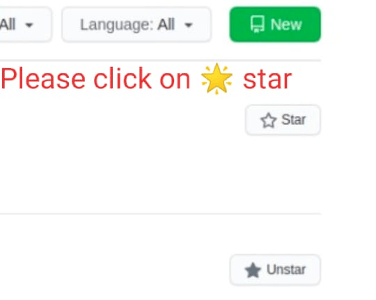

## Follow Me:

    

## Hi there 👋

# Diabetes_Predictor-AND-Web_App
## Dataset
The original dataset for this project can be found at [Diabetes Dataset](https://www.kaggle.com/johndasilva/diabetes).
## About
To predict whether a person is Diabetic or Non Diabetic Random Forest Classifier was used on the Dataset. The implementation can be found in [Diabetes_Prediction.ipynb](https://github.com/venugopalkadamba/Diabetes_Predictor-AND-Web_App/blob/master/Diabetes_Prediction.ipynb). 
Flask Web Framework is used for deploying the Machine Learning Model. 
The whole model is developed by using Python version 3.6. 
The above model can be run on your local computer by downloading this whole file and running it in command prompt by following command: python app.py.

### Library Installation :
 -  pip install -r requirements.txt 

### Train the model on Jupyter notebook:
 - Diabetes_Prediction.ipynb

### Predict the model
 - python app.py
 

## WEB APP

## Please Star me on GitHub 
## Please follow me on GitHub

https://github.com/RakeshKumar045?tab=repositories

## Thank you for reaching out to me on Github. 